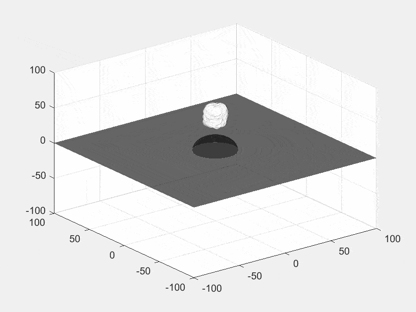
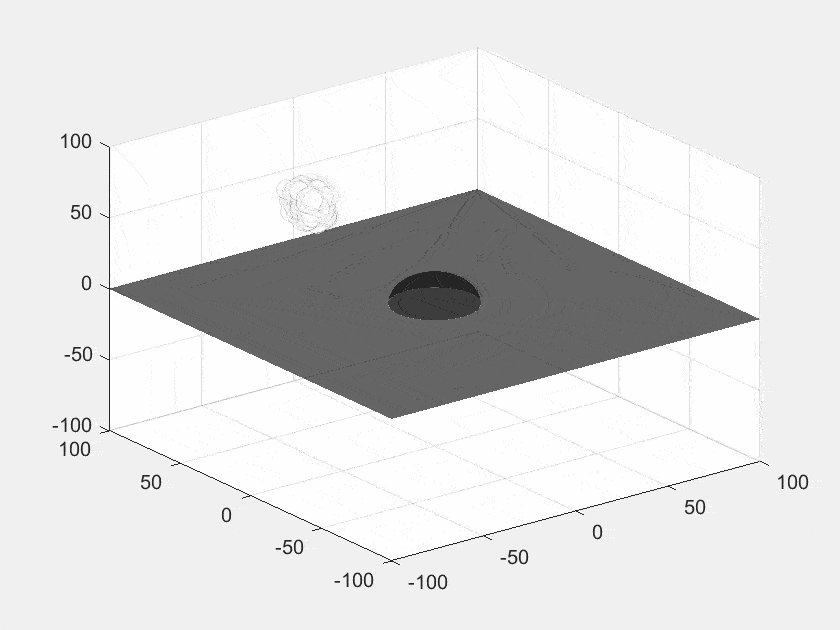
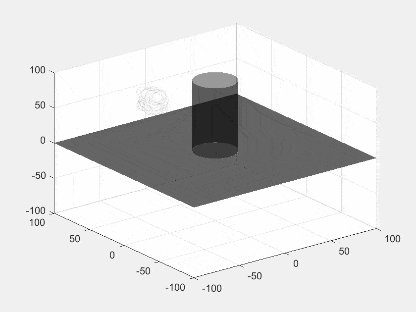

# Liquid Foam Simulation

    

## What's this
This is a Matlab project for simulating liquid foams. 

The algorithm is based on the method presented by the paper in [*Reference*](#Reference) with some modifications. To improve computing efficiency, it has been optimised to a vectorized version.

This project may also be useful for designing a decentralised flocking algorithm for robotic swarms.

## How to use
Put the two m-files (a script file and a function file) in the same directory, then run the script file [simulate.m](/code/simulate.m)

The main algrithm is presented in the function file [computeNext.m](/code/computeNext.m).

You can modify the setting parameters in [simulate.m](/code/simulate.m).

## Reference
[1] Kueck, Hendrik & Vogelgsang, Christian & Unther Greiner, G. (2002). Simulation and Rendering of Liquid Foams. Proceedings - Graphics Interface. 

[2] D. Weaire and S. Hutzler. The Physics of Foams. Oxford University Press, 1999
